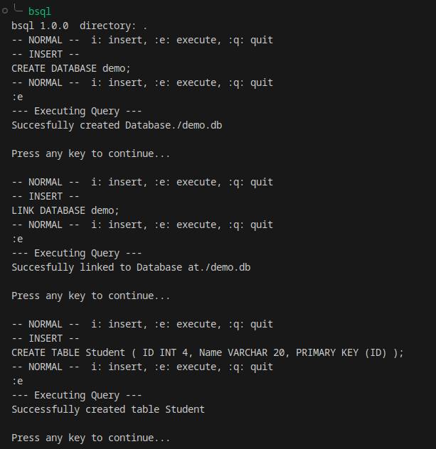
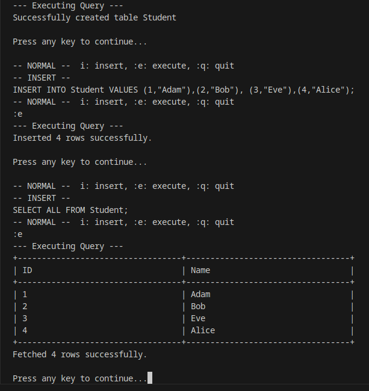

# Custom SQL Journey

> *A hand-built SQL engine in C++ — from raw bytes on disk to an interactive terminal editor.*

---

## What is this?

**`bsql`** is a custom, file-backed relational database engine built entirely from scratch in C++20 — no SQLite, no external DB library, no shortcuts.

It implements every layer of a real SQL system:

| Layer | What was built |
|---|---|
| **Storage** | Page-based disk manager, LRU buffer pool manager |
| **Execution** | Volcano-model executor pipeline (SeqScan → Filter → Projection) |
| **Catalog** | System catalog with full CRUD — tables, rows, schemas |
| **Parser** | Trie-based lexer, interpreter, and compiler for 13 SQL commands |
| **Application** | CMake build system, `bsql` CLI with a vim-inspired modal editor |

The result is a working interactive SQL editor you can install and run locally.

---

## Why?

I was bored during a vacation and wanted to know how SQL actually works under the hood.

My main language is C++ — I have plenty of competitive programming and DSA practice with it, but no real low-level project in it. SQL felt like the right balance: complex enough to force real learning, but not so large it would break my brain entirely.

What followed was five phases worth of serialisation, executor trees, LRU eviction, Trie-based tokenisation, Reverse Polish Notation expression parsing, and a modal terminal editor. Theory topics I'd mugged up for exams — OS pages, automata, DBMS internals — came alive in actual runnable code.

It was not always fun. But it was absolutely worth it.

---

## Quick Start

```bash
git clone https://github.com/Once-1296/Custom_SQL_Journey.git
cd Custom_SQL_Journey
mkdir build && cd build
cmake ..
cmake --build .
./bsql          # launch the interactive editor
```

See the [full setup guide](https://github.com/Once-1296/Custom_SQL_Journey#installation--setup) in the README for macOS and Windows instructions and optional system-wide installation.

---

## The Journey at a Glance

```
Phase 1  →  Phase 2  →  Phase 3  →  Phase 4  →  Phase 5
  OS          Volcano     System      Parser      Application
  Layer       Model       Catalog     (Automata)  (bsql CLI)
```

Dive into the [Project Journey](journey/index.md) section for the detailed story of each phase.

---




