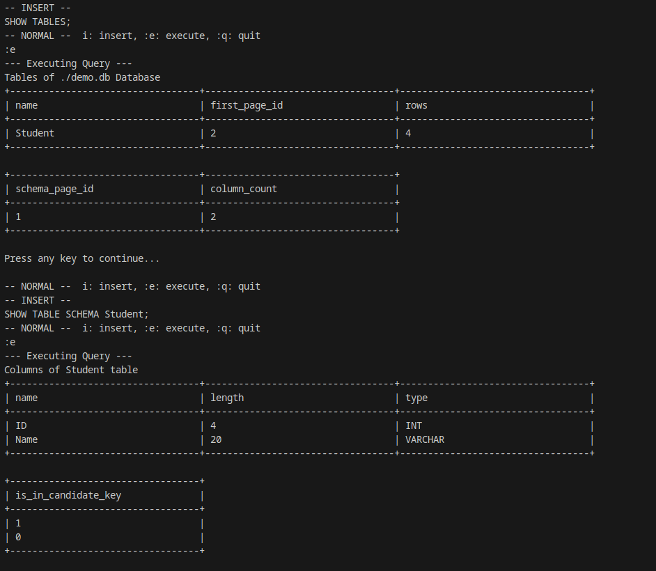

# Phase 3 — The System Catalog

<span class="phase-badge">6 days</span>

> *"The whole database can be considered as a Forest of Linked Lists. The head is Page 0, which holds the table metadata."*

---

## What this phase built

The **brain** of the database — the system catalog.
This is where abstract executors meet a real database structure: tables, schemas, and rows that persist across sessions.

---

## Storage Architecture — The Metadata Forest

Instead of a file-per-table approach, the entire database lives in a **single `.db` file** structured as a forest of linked page lists:

```
Page 0  ──  Table Metadata  (one row per table)
              │
              ├── schema_page_id  →  Column Metadata pages  →  ...  →  0xFFFFFFFF
              │
              └── first_page_id  →  Data pages  →  ...  →  0xFFFFFFFF
```

- **Page 0** is always the root — it holds one row per table with name, first data page, schema page, and row count.
- Each table has two linked lists: one for its column definitions, one for its actual data rows.
- `0xFFFFFFFF` marks the end of any list (tombstone sentinel).

The two fixed internal schemas are:

```cpp
// Table metadata row
const Schema tab_schema({
    {"name",           TypeId::VARCHAR, 64},
    {"first_page_id",  TypeId::INT32,   4},
    {"rows",           TypeId::INT32,   4},
    {"schema_page_id", TypeId::INT32,   4},
    {"column_count",   TypeId::INT32,   4},
});

// Column metadata row
const Schema col_schema({
    {"name",               TypeId::VARCHAR, 32},
    {"length",             TypeId::INT32,   4},
    {"type",               TypeId::INT32,   4},
    {"is_in_candidate_key",TypeId::INT32,   4},
});
```

---

## Operations Implemented

### `CreateTable`

Checks for duplicate name → writes table metadata to Page 0 → allocates a schema page and writes column definitions → returns the new table's first data page ID.

### `InsertRow`

Validates each row against the table schema (type, length, no duplicate candidate key). **Atomicity**: if any row in a batch is invalid, the entire batch is rejected.
Uses `InsertionExecutor` which traverses the data page linked list, appending to the last page or allocating a new one.

### `Query` (SELECT)

Assembles the Phase 2 pipeline — `SeqScan → Filter → Projection` — over the table's data pages, returning `(bool, Schema, vector<Tuple>)`.
Results are formatted as a PostgreSQL-style ASCII table in the terminal.

### `UpdateRow`

Uses `UpdateExecutor` (child: FilterExecutor) to rewrite column values in-place.
Primary key columns are **immutable** — any attempt to update them is rejected.

### `DeleteRow`

Uses `DeleteExecutor` (child: FilterExecutor).
Deleted slots use a **tombstone flag** — the slot is zeroed but the page slot count is unchanged.

### `DeleteTable`

Tombstone-deletes every page in both linked lists (data + schema), then removes the metadata row from Page 0.
Deleted pages are tracked by the DiskManager so they can be **reused** by `AllocatePage` instead of growing the file.

---

## New Executors

Three new executors joined the pipeline in this phase:

| Executor | Purpose |
|---|---|
| `InsertionExecutor` | Traverses the page list and appends tuples |
| `UpdateExecutor` | Rewrites field values in-place using an RID |
| `DeleteExecutor` | Marks slots as deleted using tombstone pattern |

---



---

!!! success "Phase 3 complete"
    A complete, persistent relational storage engine with full CRUD, a metadata forest, candidate key enforcement, and tombstone deletion.
