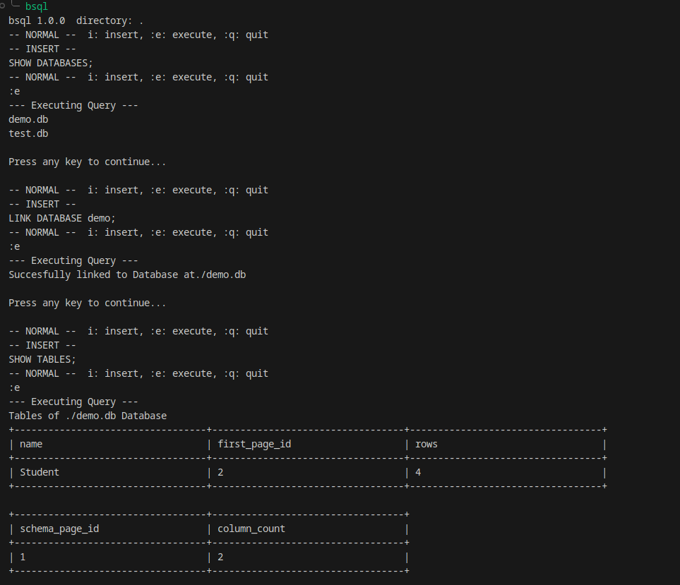
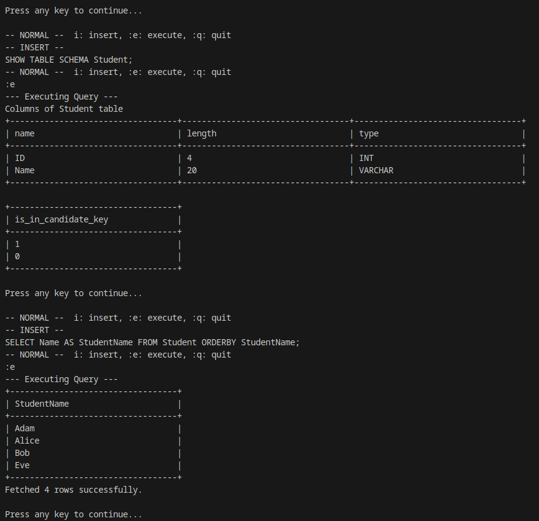
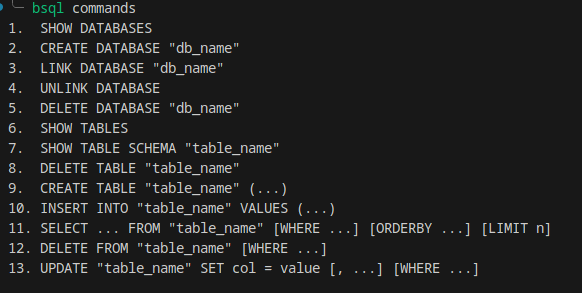

# Phase 5 — The Application

<span class="phase-badge">Release</span>

> *"Although many features can still be added, I want to first get a real-world product. And what better way than to use CMake."*

---

## What this phase built

The final two files: **`CMakeLists.txt`** and **`main.cpp`**.
Together they wrap the entire engine into a distributable binary — **`bsql`** — with a vim-inspired modal terminal editor.

---

## CMake Build

The project uses **CMake (v3.16+)** with C++20.

```bash
mkdir build && cd build
cmake ..
cmake --build .
sudo cmake --install .  # optional — installs bsql system-wide
```

After building, the `bsql` binary is available in `build/` (or system PATH if installed).

---

## The `bsql` CLI

### Usage

| Command | Description |
|---|---|
| `bsql` | Start the interactive editor in the current directory |
| `bsql /path/to/dir` | Start the editor using that directory as the database root |
| `bsql commands` | Print all 13 supported SQL commands |
| `bsql command <1–13>` | Explain a specific command |
| `bsql --version` | Print the version (`1.0.0`) |
| `bsql --help` | Show help text |

---

## The Modal Editor

`main.cpp` implements a **vim-style two-mode terminal editor** using low-level C++ terminal control (no curses dependency):

```
┌──────────────────────────────────────────────────┐
│  bsql  v1.0.0                                    │
│  Mode: INSERT                                    │
│                                                  │
│  SELECT name, age                                │
│  FROM users                                      │
│  WHERE age > 21;                                 │
│                                                  │
│  :e ↵  execute   :q ↵  quit   Esc  normal mode  │
└──────────────────────────────────────────────────┘
```

### Keybindings

| Key | Mode | Action |
|---|---|---|
| `i` | Normal | Enter Insert mode — start typing a query |
| `Esc` | Insert | Return to Normal mode |
| `:e` + Enter | Normal | Execute the current multi-line query |
| `:q` + Enter | Normal | Quit `bsql` |

Multi-line queries are supported — press Enter inside Insert mode to add a new line.
The semicolon `;` terminates a query; `:e` sends the buffer to the Compiler.

---






---

!!! success "Phase 5 complete — project shipped!"
    A real, installable SQL engine binary. Five phases, from raw bytes to a working interactive editor.
